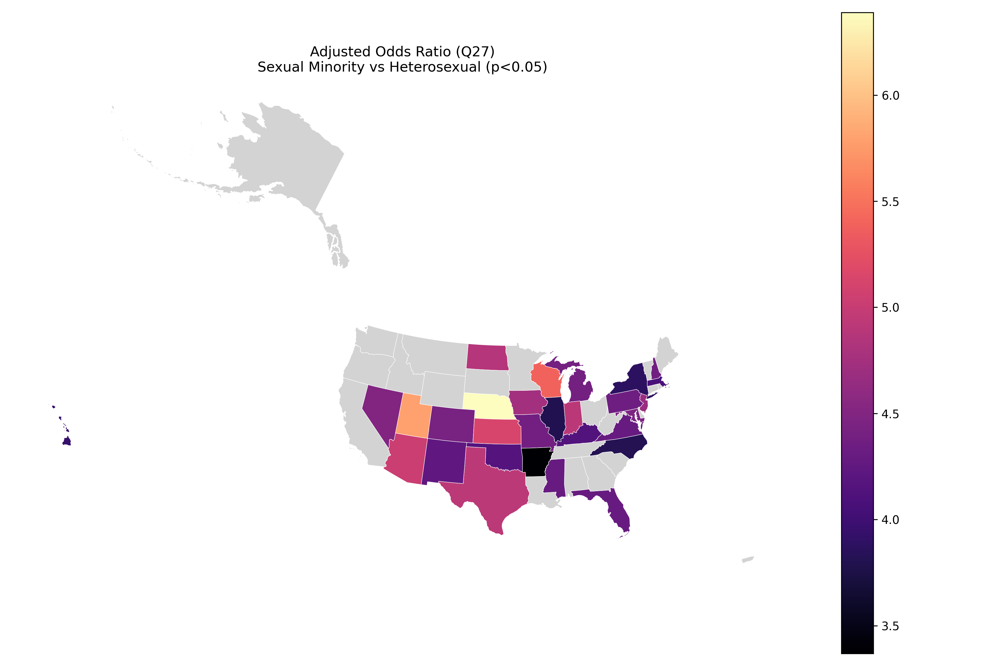
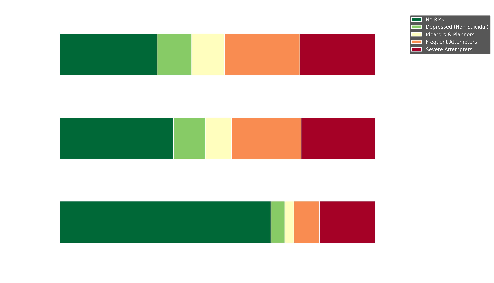
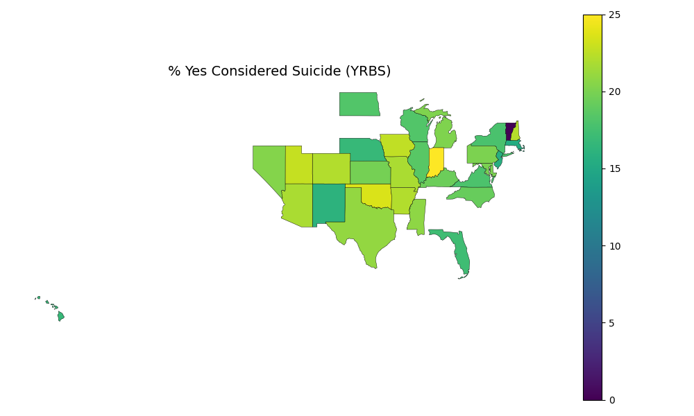
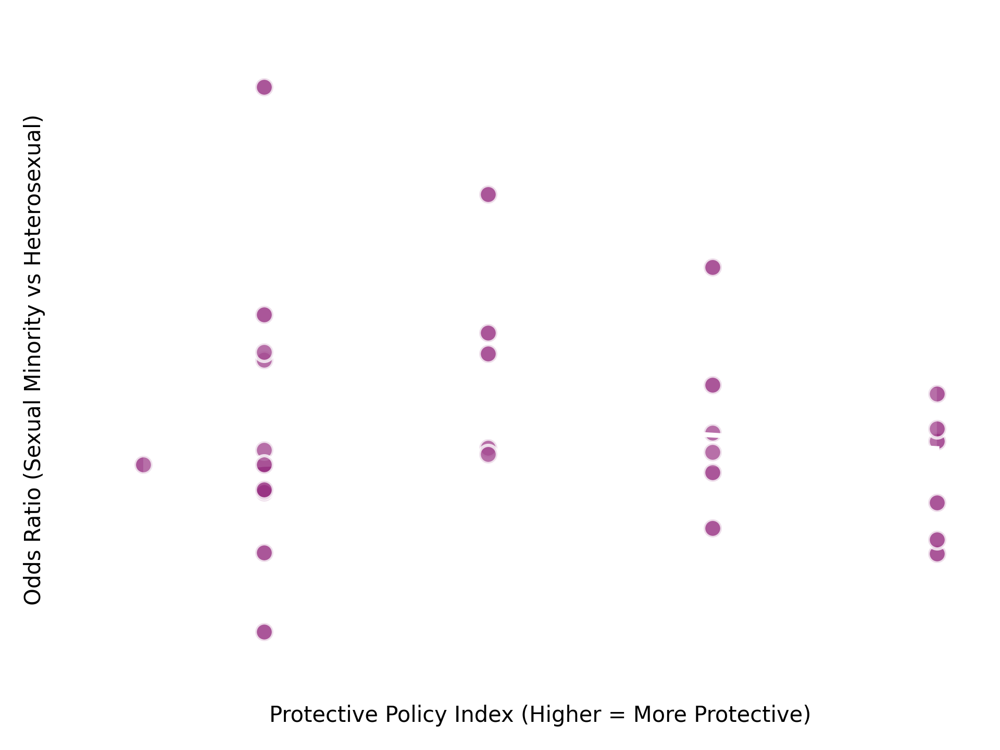

# Geospatial Analysis of State-Level LGBTQ+ Policies & Youth Mental Health Outcomes

[](https://www.python.org/)
[](https://opensource.org/licenses/MIT)
[](https://www.si.umich.edu/)
[](https://umich.edu/)

A geospatial data science and epidemiological study evaluating the association between state-level LGBTQIA+ legislative policy climates (protective vs. harmful policies) and mental health outcomes—specifically suicidal ideation—among sexual minority youth across the United States.

---

## 📌 Executive Summary & Research Questions

The prevalence of adolescent mental health challenges has risen markedly over the past decade. Recent psychiatric and public health literature suggests that structural stigma—reflected in state-level legal protections or exclusionary legislation—acts as a significant environmental stressor on sexual minority youth.

This project integrates national youth behavioral health survey microdata with state legislative policy scores and GIS shapefiles to address three core research questions:
1. **Disparity Assessment:** Are sexual minority youth at significantly higher risk for suicidal ideation compared to heterosexual peers across U.S. states?
2. **Policy Climate Impact:** Do protective versus harmful state-level LGBTQIA+ policy environments correlate with youth suicidal ideation rates?
3. **Spatial Disparities & Clustering:** What spatial patterns, regional clusters, and state-level disparities emerge when mapping policy indices against adolescent mental health outcomes?

---

## 📊 Key Findings & Visualizations

### 1. Geospatial Policy & Odds Ratio Mapping
Linking state-level legislative indices with youth behavioral data revealed clear geographic clustering. States with more protective LGBTQ+ policies consistently correlated with lower relative odds of suicidal ideation among sexual minority youth.

<p align="center">
  
</p>

### 2. Statistical Disparities in Suicidal Ideation
Chi-square tests of independence and multivariable logistic regression demonstrated pronounced, statistically significant disparities in suicidal ideation between sexual minority and heterosexual youth cohorts.

<p align="center">
  
  
</p>

### 3. Policy Index Regression & Clustering
Linear and logistic regression models quantitatively captured the gradient between state policy tallies and youth mental health trajectories, complemented by unsupervised clustering (K-Means & Hierarchical) to segment state legislative profiles.

<p align="center">
  
</p>

---

## 🛠️ Data Sources & Tech Stack

### Data Sources
* **CDC Youth Risk Behavior Surveillance System (YRBSS):** National and state-level microdata measuring sexual identity, depressive symptoms, and suicidal ideation across high school students.
* **ICPSR LGBTQ+ Policy Data (Study 37877):** State-by-state legislative tallies aggregating nondiscrimination protections, healthcare access, anti-bullying laws, and harmful/restrictive statutes.
* **U.S. Census Bureau TIGER/Line Shapefiles (2022):** 1:20,000,000 cartographic boundary shapefiles of U.S. states used for GIS joins and spatial visualization.

### Technologies
* **Language:** Python 3.10+
* **Geospatial & Vector Data:** `geopandas`, `shapely`
* **Statistical Modeling & Machine Learning:** `statsmodels`, `scipy`, `scikit-learn` (K-Means, Agglomerative Clustering)
* **Visualization:** `matplotlib`, `seaborn`
* **Environment:** Jupyter Notebook

---

## 📁 Repository Structure

```
├── cb_2022_us_state_20m/            # U.S. Census Bureau TIGER/Line state shapefiles
│   ├── cb_2022_us_state_20m.shp
│   ├── cb_2022_us_state_20m.dbf
│   └── ...
├── policy_data/                     # State-level LGBTQ+ policy index dataset
│   └── policy_2020_data.csv
├── 618_project copy.ipynb           # End-to-end data pipeline, geospatial modeling & statistical analysis
├── *.png                            # Exported high-resolution figures & choropleth maps
├── requirements.txt                 # Python dependencies
├── .gitignore                       # Standard Python, large data (>100MB) & cache exclusions
├── LICENSE                          # MIT License
└── README.md                        # Project documentation
```

> **Note on Microdata:** Due to GitHub's file size limit (100 MB), the raw multi-gigabyte CDC YRBSS state microdata files (`state_data/`) are excluded from version control. They can be downloaded directly from the [CDC YRBSS Data Portal](https://www.cdc.gov/yrbs/data/index.html) and placed into `state_data/` for local replication.

---

## 🚀 Getting Started

### Prerequisites
* Python 3.10+
* `pip` or `conda`

### Installation

1. **Clone the repository:**
   ```bash
   git clone https://github.com/jonkang/lgbtq-policy-youth-mental-health.git
   cd lgbtq-policy-youth-mental-health
   ```

2. **Create and activate a virtual environment:**
   ```bash
   python3 -m venv .venv
   source .venv/bin/activate   # On Windows: .venv\Scripts\activate
   ```

3. **Install dependencies:**
   ```bash
   pip install -r requirements.txt
   ```

4. **Launch the Jupyter Notebook:**
   ```bash
   jupyter notebook "618_project copy.ipynb"
   ```

---

## 👥 Authors & Academic Context

* **Project Course:** SI 618 – Data Manipulation and Analysis, University of Michigan School of Information
* **Team Members:**
  * **Jonathan Kang** ([@jonkang](https://github.com/jonkang))
  * **Amanpreet Bhogal**
  * **Kelly Nguyen**

---

## 📄 License

This project is licensed under the MIT License - see the [LICENSE](LICENSE) file for details.
